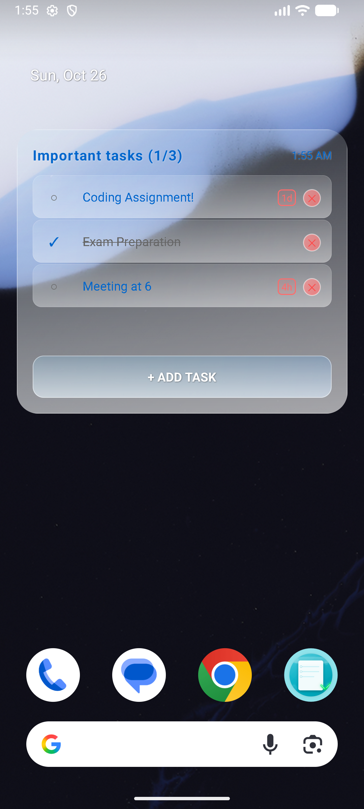

# Task Manager App with Widget

 A Frutiger Aero–style Android task app with a clear glass widget and full task management features.

## 🚀 Features

### Core Functionality
- ✅ **Task Management**: Create, edit, delete, and organize tasks
- ✅ **Subtasks Support**: Create nested subtasks for better organization
- ✅ **Multiple Lists**: Create and manage multiple task lists
- ✅ **Due Dates & Reminders**: Set due dates with smart time indicators
- ✅ **Drag & Drop**: Reorder tasks with intuitive drag and drop
- ✅ **Task Completion**: Mark tasks as complete with visual indicators

### Widget Features
- 📱 **Home Screen Widget**: Access and manage tasks directly from home screen
- 🔄 **Real-time Sync**: Widget automatically syncs with main app
- ✅ **Quick Actions**: Toggle completion and delete tasks from widget
- ⏰ **Due Date Display**: See upcoming due dates in widget
- 📋 **Multiple List Support**: Widget shows current selected list

### Smart Features
- 🎯 **Progress Tracking**: See completion progress for tasks with subtasks
- ⏰ **Smart Time Display**: Due dates show as "2h", "1d", "3w" for quick reading
- 🔄 **Auto-refresh**: Main app updates when changes are made in widget
- 🎨 **Beautiful UI**: Clean, modern interface with intuitive controls

---

## 📸 Screenshots


- Main app interface
- Widget on home screen
- Task creation dialog
- List management

---

## 🛠️ Installation

### Prerequisites
- Android Studio Arctic Fox or later
- Android SDK 26+ (Android 8.0 Oreo)
- Java 8 or Kotlin support

### Building from Source

1. **Clone the repository**
   ```bash
   git clone https://github.com/meharbaan2/TasksApp
   cd tasks-app

2. **Open in Android Studio**
   ```bash
   git clone https://github.com/meharbaan2/TasksApp
   cd tasks-app

3. **Build and Run**
   ```bash
   git clone https://github.com/meharbaan2/TasksApp
   cd tasks-app   

---

## 📱 Usage

### Managing Tasks
- **✅ Complete**: Tap the circle checkbox
- **✏️ Edit**: Long press on any task  
- **🗑️ Delete**: Tap the delete button
- **↕️ Reorder**: Drag using the handle on the left

### Using Subtasks
1. Tap the **+** button on any task
2. Enter subtask text
3. Subtasks will appear indented under main tasks

### Setting Due Dates
1. Tap the **⏰ clock icon** on any task
2. Choose from quick options or set custom date/time
3. Due dates appear with smart time indicators (2h, 1d, 3w)

### Using Multiple Lists
1. Tap **Manage Lists** in the top right
2. Create new lists or switch between existing ones
3. Each list maintains its own set of tasks

### Widget Setup
1. Long press on home screen
2. Select **Widgets**
3. Find **Task Widget** and place it on home screen
4. Widget automatically syncs with current list

---

## 🏗️ Architecture

### Technologies Used
- **Kotlin**: Primary programming language
- **Android App Widgets**: For home screen widget
- **SharedPreferences**: Local data storage
- **JSON**: Data serialization format
- **Material Design**: UI components and guidelines

### Key Components
- `MainActivity.kt`: Main app interface and logic
- `TaskWidget.kt`: Home screen widget provider
- `Task.kt`: Task data model
- `TaskList.kt`: Task list data model

---

## 🔧 Configuration

### Widget Configuration
The widget automatically uses the currently selected list from the main app. No additional configuration needed.

### Permissions
This app requires no special permissions - everything works offline and locally.
